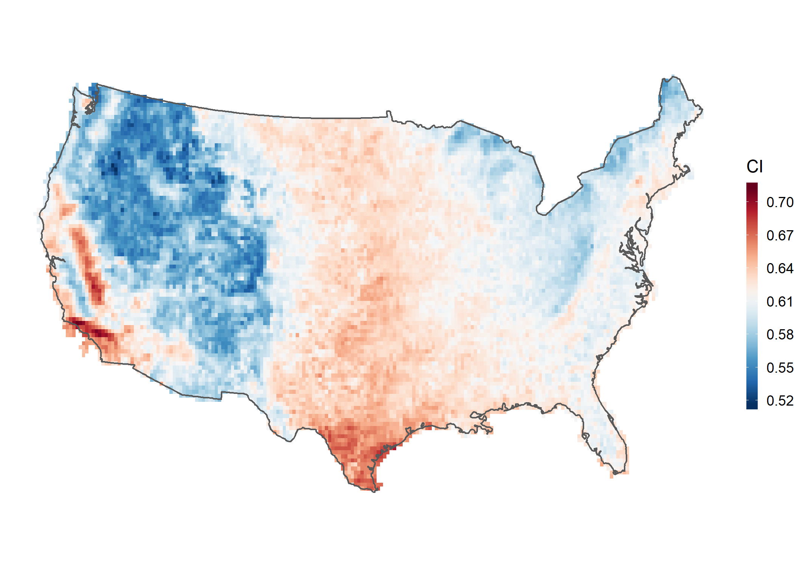
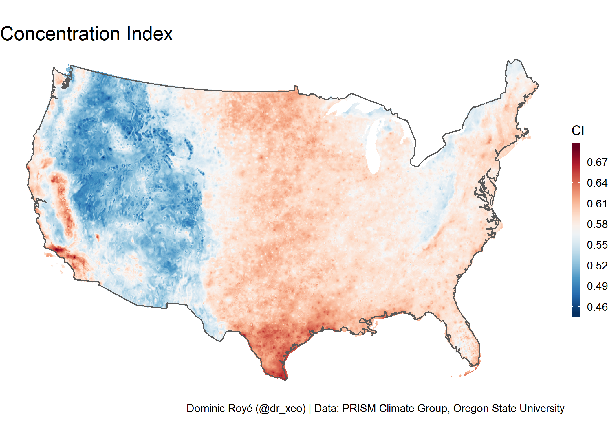

Concentration of daily precipitation in the contiguous United States 1956–2006
================
Dominic Royé
9 de diciembre de 2018

Abstract
--------

The contiguous US exhibits a wide variety of precipitation regimes, first, because of the wide range of latitudes and altitudes. The physiographic units with a basic meridional configuration contribute to the differentiation between east and west in the country while generating some large interior continental spaces. The frequency distribution of daily precipitation amounts almost anywhere conforms to a negative exponential distribution, reflecting the fact that there are many small daily totals and few large ones. Positive exponential curves, which plot the cumulative percentages of days with precipitation against the cumulative percentage of the rainfall amounts that they contribute, can be evaluated through the Concentration Index. The Concentration Index has been applied to the contiguous United States using a gridded climate dataset of daily precipitation data, at a resolution of 0.25°, provided by CPC/NOAA/OAR/Earth System Research Laboratory, for the period between 1956 and 2006. At the same time, other rainfall indices and variables such as the annual coefficient of variation, seasonal rainfall regimes and the probabilities of a day with precipitation have been presented with a view to explaining spatial CI patterns. The spatial distribution of the CI in the contiguous United States is geographically consistent, reflecting the principal physiographic and climatic units of the country. Likewise, linear correlations have been established between the CI and geographical factors such as latitude, longitude and altitude. In the latter case the Pearson correlation coefficient (r) between this factor and the CI is −0.51 (p-value &lt; 0.001). For annual probability of days with precipitation and the CI there is also a significant and negative correlation, r = −0.25 (p-value &lt; 0.001).

Figures
-------

-   Fig. 8. Concentration Index values (1956–2006).

``` r
#libraries
library(ggplot2)
library(sf)
```

    ## Linking to GEOS 3.6.1, GDAL 2.2.3, PROJ 4.9.3

``` r
library(raster)
```

    ## Warning: package 'raster' was built under R version 3.5.1

    ## Loading required package: sp

``` r
library(RColorBrewer)

#import raster
ci_raster <- raster("Data/ci_raster_USA.tif")

#import administrative limits
limit <- st_read("Data/USA_limit/USA_continental.shp")
```

    ## Reading layer `USA_continental' from data source `C:\Users\xeo19\Documents\GitHub\Concentration_Index_USA\Concentration_Index_USA\Data\USA_limit\USA_continental.shp' using driver `ESRI Shapefile'
    ## Simple feature collection with 1 feature and 13 fields
    ## geometry type:  POLYGON
    ## dimension:      XY
    ## bbox:           xmin: -124.7158 ymin: 25.11555 xmax: -66.96889 ymax: 49.37666
    ## epsg (SRID):    4326
    ## proj4string:    +proj=longlat +datum=WGS84 +no_defs

``` r
#raster to data.frame
df <- as.data.frame(ci_raster,xy=TRUE,na.rm=TRUE)
names(df)[3] <- "CI" #rename variable column

col_ci <- brewer.pal(11,"RdBu") #colors

#plotting
ggplot()+
    geom_tile(data=df,
            mapping=aes(x,y,fill=CI))+
     geom_sf(data=limit,fill="transparent")+
       scale_fill_gradientn(colours=rev(col_ci))+
       coord_sf(crs=2163,datum=NA)+
      theme_void()
```



-   Fig. 4. Seasonal rainfall regimes (1956–2006) (P, spring, S, summer, A, autumn, W, winter)

``` r
#libraries
library(ggplot2)
library(sf)
library(raster)
library(RColorBrewer)

#import raster
regp_raster <- raster("Data/pulvio_regimes_raster_USA.tif")

#import administrative limits
limit <- st_read("Data/USA_limit/USA_continental.shp")
```

    ## Reading layer `USA_continental' from data source `C:\Users\xeo19\Documents\GitHub\Concentration_Index_USA\Concentration_Index_USA\Data\USA_limit\USA_continental.shp' using driver `ESRI Shapefile'
    ## Simple feature collection with 1 feature and 13 fields
    ## geometry type:  POLYGON
    ## dimension:      XY
    ## bbox:           xmin: -124.7158 ymin: 25.11555 xmax: -66.96889 ymax: 49.37666
    ## epsg (SRID):    4326
    ## proj4string:    +proj=longlat +datum=WGS84 +no_defs

``` r
#import clasification for regimes
reg.df <- read.csv("Data/pulvio_regimes_id.csv")

#raster to data.frame
df <- as.data.frame(regp_raster,xy=TRUE,na.rm=TRUE)
names(df)[3] <- "regp" #rename variable column

#add labels to variable
df[,"regp"] <- factor(df[,"regp"],levels=reg.df$id,labels=reg.df$reg)


#color definitions
gre <- rev(c('#edf8e9','#c7e9c0','#a1d99b','#74c476','#31a354','#006d2c'))
bl <- rev(c('#eff3ff','#c6dbef','#9ecae1','#6baed6','#3182bd','#08519c'))
roj <- rev(c("#ffffb2","#fed976","#feb24c","#fd8d3c","#f03b20","#bd0026"))
viol <- rev(c('#feebe2','#fcc5c0','#fa9fb5','#f768a1','#c51b8a','#7a0177'))


#plotting
ggplot()+
  geom_tile(data=df,mapping=aes(x,y,fill=regp,group=1))+
  geom_sf(data=limit,fill="transparent")+
  scale_fill_manual("Pluviometric regimes",values=c(gre,roj,viol,bl))+
  coord_sf(crs=2163,datum=NA)+
  theme_void()
```



Map projection
--------------

EPSG:2163 proj4: "+proj=laea +lat\_0=45 +lon\_0=-100 +x\_0=0 +y\_0=0 +a=6370997 +b=6370997 +units=m +no\_defs"

How to cite
-----------

Royé D & Martin-Vide J (2017). Concentration of Daily Precipitation in the Contiguous United States. Atmospheric Research, 196C:237-247, doi: [10.1016/j.atmosres.2017.06.011](https://doi.org/10.1016/j.atmosres.2017.06.011).
